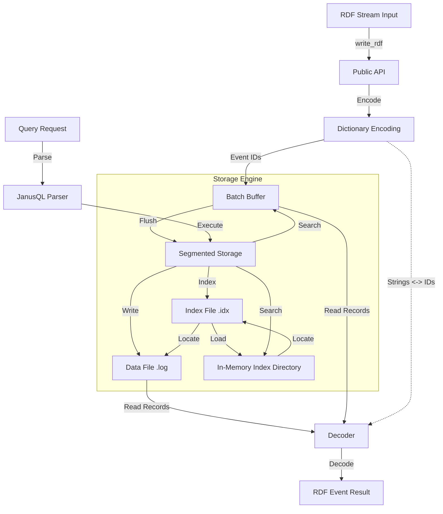

# Janus Architecture Documentation

## Overview

Janus is a hybrid engine for unified Live and Historical RDF Stream Processing, implemented in Rust. It is designed for high-throughput ingestion and querying of RDF streams, utilizing a custom segmented storage engine with dictionary encoding and two-level indexing.

## System Architecture

The system is composed of the following core modules:

## Core Components

### 1. Core Data Structures (`src/core`)

*   **Event**: The internal representation of an RDF event. It uses integer IDs for efficient storage and processing.
    *   `timestamp`: `u64` (milliseconds since epoch)
    *   `subject`, `predicate`, `object`, `graph`: `u32` (dictionary encoded IDs)
    *   **Size**: 24 bytes (vs ~40+ bytes for raw pointers/strings), achieving ~40% space efficiency.
*   **RDFEvent**: The user-facing representation with `String` fields for subject, predicate, object, and graph.

### 2. Storage Engine (`src/storage`)

The storage engine is designed for high write throughput and fast time-based range queries.

*   **StreamingSegmentedStorage**: The main coordinator.
    *   **BatchBuffer**: An in-memory `VecDeque` that buffers incoming events. This allows for immediate visibility of recent data and high ingestion rates.
    *   **Segments**: Data is persisted in immutable segments on disk. Each segment consists of:
        *   **Data File (`.log`)**: Stores fixed-size (24-byte) `Event` records sequentially.
        *   **Index File (`.idx`)**: Stores sparse index blocks mapping timestamps to file offsets.
    *   **Background Flushing**: A dedicated thread monitors the `BatchBuffer` and flushes it to a new disk segment when it reaches size or time limits.

*   **Indexing Strategy**:
    *   **Two-Level Indexing**:
        1.  **Level 1 (Memory)**: A directory of `IndexBlock` metadata (min/max timestamp, file offset) is kept in memory for each segment. This allows quickly pruning irrelevant segments and locating the relevant index blocks on disk.
        2.  **Level 2 (Disk)**: The actual `.idx` file contains sparse entries (e.g., every 1000th event).
    *   **Binary Search**: Used within the loaded index blocks to find the exact start offset in the data file.

### 3. Dictionary Encoding (`src/storage/indexing/dictionary.rs`)

*   Maps RDF term strings (URIs, literals) to unique `u32` integers.
*   Bi-directional mapping allows encoding (String -> ID) for storage and decoding (ID -> String) for query results.
*   Crucial for reducing storage footprint and improving comparison performance.

### 4. Query Language & Parsing (`src/parsing`)

*   **JanusQL**: A query language extending SPARQL/RSP-QL.
*   **JanusQLParser**: Parses queries using Regex.
    *   **Windows**: Supports `Live`, `HistoricalSliding`, and `HistoricalFixed` windows.
    *   **Syntax**: `FROM NAMED WINDOW <name> ON STREAM <stream> [RANGE ... STEP ...]`
    *   **Output**: Generates internal query structures and translates to SPARQL/RSP-QL.

## Data Flow

### Write Path
1.  User calls `write_rdf` with string arguments.
2.  Strings are encoded to `u32` IDs using the `Dictionary`.
3.  The `Event` (24 bytes) is pushed to the `BatchBuffer`.
4.  If the buffer is full, the background thread flushes it:
    *   Sorts events by timestamp.
    *   Writes events to a new `.log` file.
    *   Builds and writes sparse index entries to a `.idx` file.
    *   Updates the in-memory segment list.

### Read Path (Query)
1.  User calls `query_rdf` with a time range.
2.  **BatchBuffer Scan**: Scans the in-memory buffer for matching events.
3.  **Segment Scan**:
    *   Filters segments based on time overlap.
    *   For each relevant segment:
        *   Checks in-memory `IndexBlock` directory.
        *   Loads relevant index blocks from `.idx` file.
        *   Performs binary search to find start offset.
        *   Scans `.log` file from offset until end timestamp.
4.  Results are merged, sorted, and decoded back to strings using the `Dictionary`.

## Performance Characteristics

*   **Write Throughput**: High, due to append-only in-memory buffering and background flushing.
*   **Read Latency**: Low, due to two-level indexing minimizing disk I/O.
*   **Space Efficiency**: High, due to dictionary encoding and compact binary format.

## Future Improvements

*   **WAL (Write-Ahead Log)**: To ensure durability in case of crashes before buffer flush (currently mentioned in comments/benchmarks but not fully integrated in the main flow shown).
*   **Advanced Querying**: Full SPARQL engine integration.
*   **Compression**: Block-level compression for data files.
