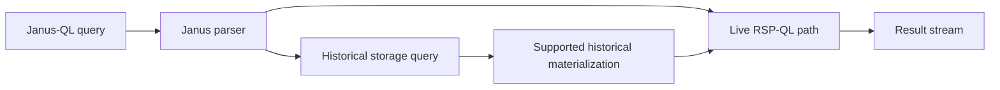
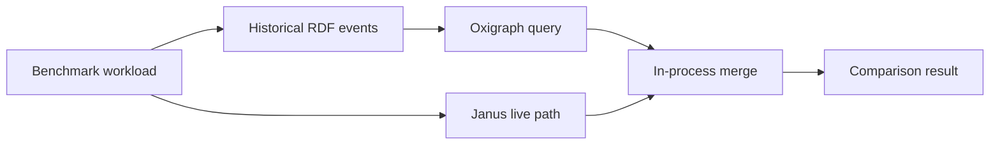
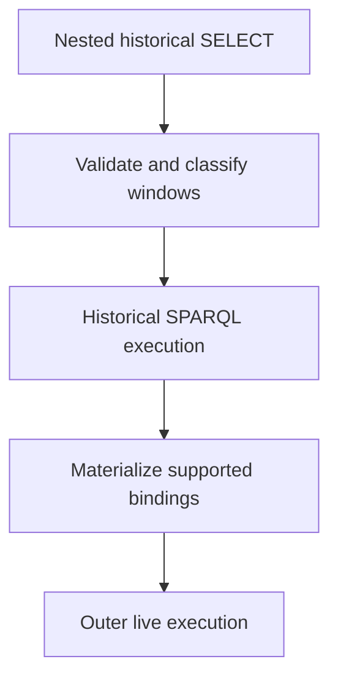

# Paper Architecture

The diagrams show the two benchmark execution shapes. They are architectural
summaries; the executable benchmark binaries and their raw artifacts are the
source of performance evidence.

## Unified Janus execution

## Decomposed comparison path

## Nested historical materialization

See [Query Execution](./QUERY_EXECUTION.md) and
[PAPER_BENCHMARKING.md](./PAPER_BENCHMARKING.md) for the operational and
evidence boundaries.
