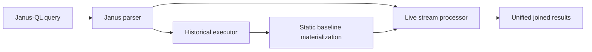
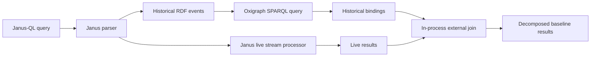
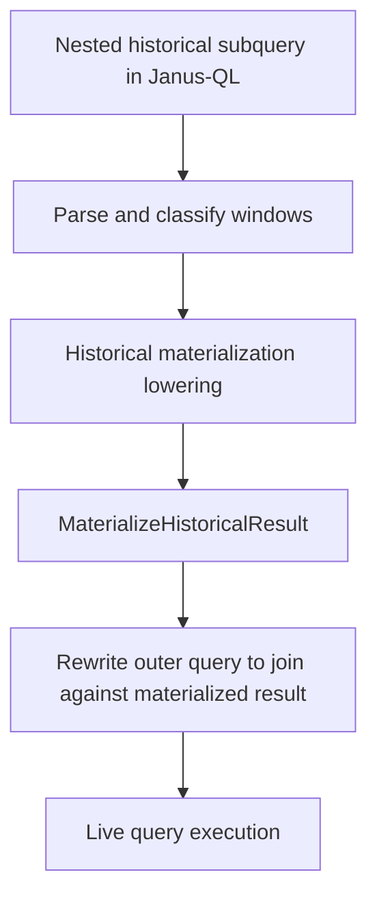

# Paper Architecture

This file shows the three paper-relevant execution shapes.

## Unified Janus Execution

```mermaid
flowchart LR
    A["Janus-QL query"] --> B["Janus parser"]
    B --> C["Historical executor"]
    B --> D["Live stream processor"]
    C --> E["Static baseline materialization"]
    E --> D
    D --> F["Unified joined results"]
```

## Decomposed Oxigraph Baseline

```mermaid
flowchart LR
    A["Janus-QL query"] --> B["Janus parser"]
    B --> C["Historical RDF events"]
    C --> D["Oxigraph SPARQL query"]
    D --> E["Historical bindings"]
    B --> F["Janus live stream processor"]
    F --> G["Live results"]
    E --> H["In-process external join"]
    G --> H
    H --> I["Decomposed baseline results"]
```

## Nested Historical Subquery Lowering

```mermaid
flowchart TD
    A["Nested historical subquery in Janus-QL"] --> B["Parse and classify windows"]
    B --> C["Historical materialization lowering"]
    C --> D["MaterializeHistoricalResult"]
    D --> E["Rewrite outer query to join against materialized result"]
    E --> F["Live query execution"]
```
