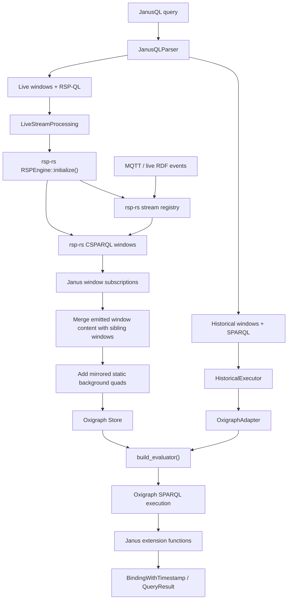

# Live Extension Function Architecture

This document describes how Janus executes Janus-specific extension functions for live queries
without modifying the upstream `rsp-rs` crate.

## Flow

## Responsibilities

- `rsp-rs`
  - stream ingestion
  - timestamp-driven window lifecycle
  - window materialization
  - window closure notifications

- `Janus`
  - JanusQL parsing
  - historical execution
  - live query orchestration
  - Janus-specific custom function registration through `build_evaluator()`
  - final SPARQL evaluation for both historical and live paths

## Why this design

- Keeps `rsp-rs` minimal and reusable.
- Avoids a Janus-specific fork or API expansion in `rsp-rs`.
- Lets Janus use the same extension-function mechanism on both historical and live queries.
- Intercepts at the materialized-window stage, so Janus does not re-evaluate already-produced live
  bindings. Instead, it performs the final SPARQL evaluation itself once per emitted window.
